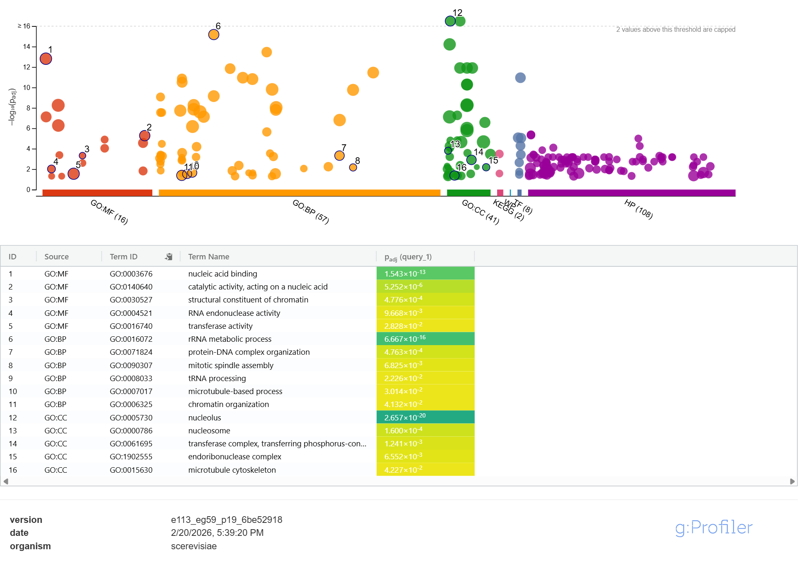
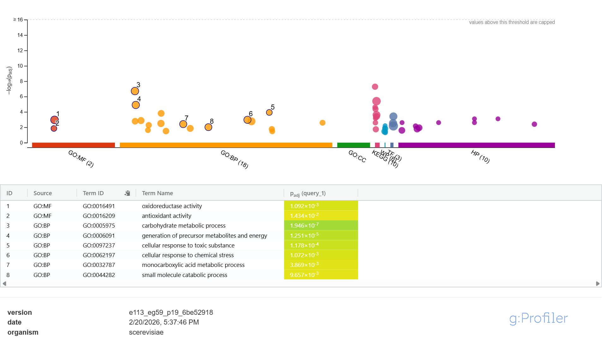

# Transcript Half-Life Analysis (Yeast mRNA Decay)


Estimates the half-life of every yeast (*Saccharomyces cerevisiae*) mRNA transcript
from a 60-minute decay time course, then uses the most and least stable transcripts
to ask: **is mRNA stability functionally meaningful, or just noise?**

## Overview

Given a 9-point decay time course (0–60 min, 3 biological replicates) of relative
mRNA abundance for ~6,100 genes, this project:

1. Fills in missing time points per replicate using linear interpolation in log-space
2. Fits an exponential decay model (linear regression on log-expression, forced
   through the origin) to estimate each transcript's decay rate
3. Converts decay rate to half-life (`t½ = ln(2) / λ`) and averages across replicates
4. Ranks all genes and pulls out the top and bottom 10% by half-life
5. Feeds those two gene lists into [gProfiler](https://biit.cs.ut.ee/gprofiler/gost)
   for GO term enrichment, to see whether short-lived vs. long-lived transcripts
   serve different biological roles

## Results

Across ~6,150 genes with a valid half-life, GO enrichment of the top/bottom 10%
gene sets showed a clear functional split:

- **Short-lived transcripts** (bottom 10%) were enriched for nucleolus, rRNA
  metabolic process, chromatin organization, and cell-cycle terms — consistent with
  genes that need to be rapidly and dynamically regulated.
- **Long-lived transcripts** (top 10%) were enriched for carbohydrate metabolism,
  energy generation, and oxidoreductase/stress-response activity — consistent with
  "housekeeping" genes that need a steady, constitutive supply of protein.

**Bottom 10% (short-lived) GO enrichment:**



**Top 10% (long-lived) GO enrichment:**



This suggests transcript stability isn't incidental — it's tuned to how quickly a
gene's product needs to be turned over. See [`results/Interpretation.docx`](results/Interpretation.docx)
for the full write-up.

## Project structure

```
.
├── data/
│   └── DecayTimecourse.txt         # Raw expression time course, 3 replicates
├── src/
│   └── halflife_analysis.py        # Full pipeline: interpolate → fit → rank
├── results/
│   ├── all_halflives.csv           # Per-gene half-lives (all 3 replicates + average)
│   ├── top10pct_genes.txt          # Most stable transcripts
│   ├── bottom10pct_genes.txt       # Least stable transcripts
│   ├── top_10.png                  # gProfiler GO enrichment (long-lived)
│   ├── bottom_10.png               # gProfiler GO enrichment (short-lived)
│   └── Interpretation.docx         # Full biological interpretation
├── requirements.txt
└── LICENSE
```

## Getting started

```bash
git clone https://github.com/<your-username>/transcript-halflife-analysis.git
cd transcript-halflife-analysis
pip install -r requirements.txt
python src/halflife_analysis.py
```

This regenerates `all_halflives.csv`, `top10pct_genes.txt`, and `bottom10pct_genes.txt`
in `results/`. The two gene lists can then be submitted directly to gProfiler (or any
GO enrichment tool) using the full gene list from `all_halflives.csv` as the
statistical background.

## Method notes

- A replicate needs **≥2** valid points before interpolation, and **≥3** valid points
  to fit a decay curve.
- Replicates where expression didn't decrease over time are excluded (half-life is
  undefined for a non-decaying series).
- A gene's final half-life is the average over whichever replicates produced a
  valid estimate (1–3 of them); genes with no valid replicate are dropped.

## Tech stack

- Python (pandas, numpy, scipy)

## License

This project is licensed under the [MIT License](LICENSE).
